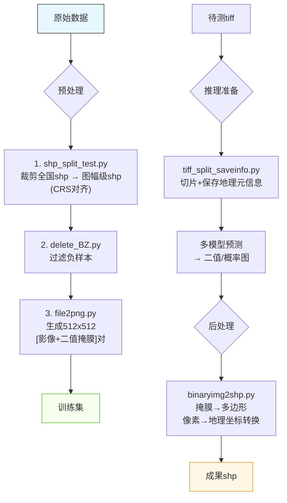

### 🌍 **自然资源部遥感数据预处理流程说明（zrzyb-preprocess）**

本项目面向自然资源部提供的遥感影像（`.tiff`）与矢量标注（`.shp`）数据，旨在构建适用于目标检测或语义分割任务（如光伏设备识别）的标准化训练/推理数据集。由于原始数据在**空间参考系**、**覆盖范围**与**分辨率**上存在异构性，需系统性完成坐标对齐、空间裁剪、样本生成与格式转换。

---

## 🛠️ 一、安装与依赖
```bash
git clone <repo-url> zrzyb-preprocess
cd zrzyb-preprocess
pip install -r requirements.txt
```

> ✅ 依赖库建议包含：`gdal`, `geopandas`, `rasterio`, `shapely`, `numpy`, `Pillow`, `opencv-python`

---

## 📊 二、数据预处理流程

### 1️⃣ **坐标系对齐与空间裁剪**
> **问题**：全国级 `.shp` 标注 vs 分幅 `.tiff` 影像 → 空间范围与投影不一致  
> **目标**：使标注与影像在**同一地理空间参考系**下精确对齐

| 步骤 | 模块 | 功能描述 |
|------|------|----------|
| ① 坐标转换 | `shp_split_test.py` | 将全国范围 `.shp` 按标准图幅（对应每个 `.tiff` 的地理边界）进行空间裁剪，并统一投影至影像 CRS（如 EPSG:3857 或 UTM） |
| ② 负样本过滤 | `delete_BZ.py` | 移除裁剪后 `.shp` 中无目标（如“非光伏”类别或空几何）的记录，提升正样本纯度 |

> 🔍 注：裁剪时需严格依据 `.tiff` 的 `GeoTransform` 与 `CRS` 提取地理边界（`rasterio.open().bounds`）。

---

### 2️⃣ **训练样本生成（512×512 图块）**
> **目标**：构建“影像块 ↔ 二值标签图”对，适配深度学习输入

| 步骤 | 模块 | 功能描述 |
|------|------|----------|
| ③ 图像切片 | `file2png.py` |  
- 遍历每对**对齐后的 `.tiff` + `.shp`**  
- 按滑动窗口（512×512，可带重叠）切割影像 → `.png`  
- 同步将 `.shp` 渲染为**二值掩膜图**（目标区域=255，背景=0）→ `.png`  
- 保存路径配对：`images/xxx.png` ↔ `labels/xxx.png` |

> ✅ 输出格式示例：
```
dataset/
├── images/
│   ├── tile_0001.png
│   └── tile_0002.png
└── labels/
    ├── tile_0001.png   # 二值掩膜
    └── tile_0002.png
```

---

## 🤖 三、模型推理流程

### 1️⃣ **推理输入准备**
| 步骤 | 模块 | 功能描述 |
|------|------|----------|
| ④ 推理图块生成 | `tiff_split_saveinfo.py` |  
- 将待预测 `.tiff` 按 512×512 切片（记录每块原始地理坐标/偏移量）  
- 存储切片图像 + 元信息（如 `tile_info.json` 记录 `(row, col, geo_transform)`）用于后处理反投影 |

---

### 2️⃣ **多模型预测**
- 支持调用不同开源框架（如 `MMSegmentation`, `Detectron2`, `YOLOv8-seg`）进行批量推理  
- 输出为同尺寸二值/概率图（`.png` 或 `.npy`）

---

## 🔄 四、结果后处理

| 步骤 | 模块 | 功能描述 |
|------|------|----------|
| ⑤ 掩膜 → 矢量 | `binaryimg2shp.py` |  
- 对每个预测 `.png` 掩膜进行连通域分析 → 提取多边形轮廓  
- 将像素坐标 **依据元信息反投影** 至地理坐标（WGS84 或原 CRS）  
- 生成标准 `.shp` 文件（含属性字段如 `score`, `area`）  
- 支持合并相邻图块结果（避免边界碎片化） |

> 📌 最终交付：地理精准、属性完备的全国光伏设施分布 `.shp`

---

## 📐 五、流程图（文字版 → 可转 Mermaid）



